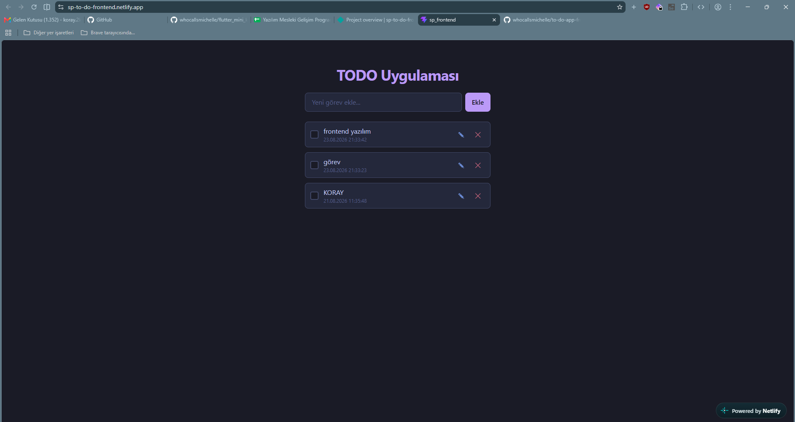

# TODO Uygulaması

React ile geliştirilmiş, görevlerinizi ekleyip takip edebileceğiniz basit bir görev takip (TODO) uygulaması.

**Canlı demo:** [sp-to-do-frontend.netlify.app](https://sp-to-do-frontend.netlify.app/)
**Repo:** [github.com/whocallsmichelle/to-do-app-frontend](https://github.com/whocallsmichelle/to-do-app-frontend)

## Kullanılan teknolojiler

- React 19
- Vite
- Tailwind CSS v4
- localStorage (veri kalıcılığı için, backend yok)

## Özellikler

- Görev ekleme
- Görevleri listeleme
- Görev başlığını düzenleme
- Görev silme
- Tamamlandı/tamamlanmadı olarak işaretleme
- Sayfa yenilense bile verilerin kaybolmaması (localStorage ile kalıcılık)

## Klasör yapısı

```
src/
  components/   # TodoForm, TodoList, TodoItem gibi UI bileşenleri
  pages/        # Sayfa bileşenleri
  interfaces/   # Todo veri modeli tanımı
```

## Kurulum ve çalıştırma

```bash
npm install
npm run dev
```

### Production build

```bash
npm run build
```

Çıktı `dist` klasörüne yazılır ve Netlify üzerinden yayınlanır.

## Ekran görüntüsü


